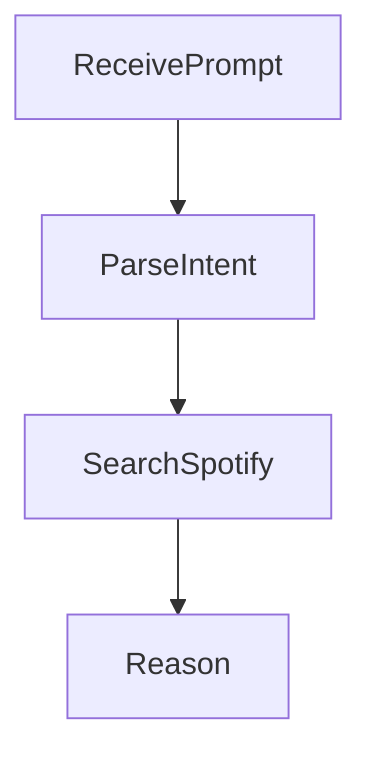

# DJ Reasoner 🎧  
*A mood-driven music recommendation agent powered by LangChain, LangGraph, Spotify API, and GPT.*

## Overview

DJ Reasoner is an intelligent agent that takes in a natural language description of a user’s desired musical vibe and returns a curated, numbered list of Spotify track recommendations. Each recommendation includes the song title, artist name, and a short, LLM-generated explanation of why the track fits the request.

## Features

- Natural language to music mapping  
- Real-time Spotify track search  
- LLM reasoning and explanation generation  
- ReAct-style agent using LangGraph with explicit state nodes

---

## How It Works

### ✅ Inputs

- A single natural language prompt, e.g.,  
  - “Chill music for studying”  
  - “Nostalgic synthwave for night driving”

### 🎵 Outputs

- A formatted, numbered list of Spotify tracks:
  ```
  1. "Title" by Artist — Explanation
  2. "Title" by Artist — Explanation
  ```

---

## Agent Architecture

Implemented as a 4-node LangGraph pipeline:

1. **ReceivePrompt** – Extracts the prompt from the user input.
2. **ParseIntent** – (Currently a passthrough) Prepares the query for search.
3. **SearchSpotify** – Calls the Spotify Web API via `spotipy` to fetch matching tracks.
4. **Reason** – Uses OpenAI GPT-3.5 to generate human-friendly explanations.



---

## Setup Instructions

1. Clone the repository and set up a Python environment.
2. Create a `.env` file with your Spotify credentials:
   ```
   SPOTIFY_CLIENT_ID=your_client_id
   SPOTIFY_CLIENT_SECRET=your_client_secret
   ```
3. Install dependencies:
   ```bash
   pip install -r requirements.txt
   ```
4. Run the app:
   ```bash
   python agent/main.py
   ```

---

## Example Usage

```
What kind of music are you in the mood for? nostalgic synthwave for night driving

=== DJ Reasoner Says ===

1. "Nightdrive" by VHS Dreams — The title says it all! This song is tailor-made for your night driving adventures.
2. "Nostalgic Synthwave (Sleep Music)" by Silent Rhythm — Dreamy, atmospheric sounds perfect for a late-night drive.
```

---

## Limitations & Future Work

- Currently doesn’t use audio features like tempo, energy, or valence from Spotify.
- Duplicate or irrelevant tracks may appear occasionally.
- Adding filter logic and incorporating Spotify audio analysis would improve recommendation accuracy.

---

## Project Files

- `main.py` – Entry script that prompts the user and runs the agent.
- `graph.py` – Defines the LangGraph agent’s flow.
- `tools.py` – Defines the Spotify API tool.
- `workflow_graph.png` – Auto-generated visual of the agent’s graph.

---

## Credits

Developed as part of **ECE 157C/272C Homework 3**  
By: Dhruv Aggarwal  
Spring 2025 – Prof. Li C. Wang
